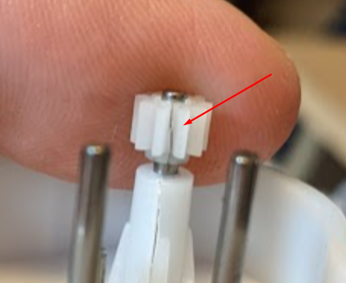

# PetNet Feeder revival

We picked up an abandoned PetNet feeder NIB from Ebay for $38 bucks. I am wanting to configure this to talk to home assistant and be able to utilize some of the sensors on unit.

## Initial analysis
So, we have a whole boatload of sensors here I mean this is like sensorama. 

-	4 - 3 wire load cells on the base used to (I think for main system weight)
-	1 - 4 wire load cell in the pull out tray.
-	1 - IR emmiter for food deetection
-	1 - IR receiver for above
-	1 - optical encoder 3 wires (do I need to worry about this?)
-   1 - Drive assembly (not a sensor but who cares)

The four load cells that attach to the fake bottom. A load cell on the food tray. Optical encoder wheel on the shaft plus, there is also an IR sensor/light pair in the hopper. 

**Normal operations (I am thinking out what I want it to do with what is supplied)**
If the sensor on the bowl is showing low turn the motor on, check to see if we have rotation. this should dispense food. I think once an hour as the ravenous horde do like their kibble. 

Check the IR sensor in the food bin once a day and verify with unit weight. Send a message if either of these is false.

**What Could go wrong**

If we don't have rotation at the encoder, should we try to back the motor up? with a quick, to try a pulse then go forward. Would that help clear the jam? If not send the notice.

## What do you mean this POS is broken out of the box. :rage:
The first test I did was hook a 5-volt power supply up to the motor to see how much food will be dispensed per amount of time. The gearbox had a nasty grinding on it and went to suddenly stop. The matter will continue to run you can hear it but nothing was happening on the other end of the gearbox.

Now this is right out of the box I have done nothing to damage anything as far as the drive mechanism. So, I tear down the gear assembly and the tiny year attached to the motor has a crack in it. You can see the little booger below.

## Steps to Feeder Freedom

I need to replace the LED in the button with a Neopixel from a strip of LEDs, as I don't feel like researching what LED they have in there.